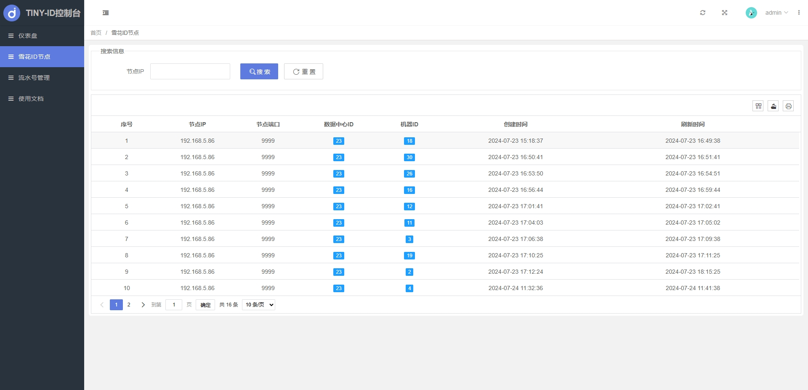

# Tiny ID
# 一个轻量、灵活、高性能的分布式 ID 生成器系统

<a href='https://gitee.com/leisureLXY/tiny-id/stargazers'></img></a>
<a href='https://gitee.com/leisureLXY/tiny-id/members'></img></a>

## 简介 
Tiny ID 是一个基于SpringBoot+MySQL的轻量级、灵活、高性能的分布式ID生成器系统。

- Java语言开发，天然具有跨平台的优点。
- 架构简单，仅依赖于Java和MySQL数据库。
- 支持集群环境分布式部署，可部署多个节点。
- 同时支持 `数据库号段` 和 `snowflake雪花算法` 两种生成模式，可自由根据需求进行选择。
- `snowflake雪花算法` 模式，支持服务启动时自动分配数据中心ID和机器ID，无需手动配置。
- 通过http方式访问生成id，简洁灵活，方便业务系统接入。
- 提供控制台管理功能，支持数据监控、雪花ID节点查看，流水号管理等功能，界面操作友好。

## 性能
测试环境：windows 4核心、16G内存

1. 数据库号段模式
在将步长(step)设置成100时，使用 `Apache JMeter (5.5)` 进行压测，吞吐量可达 12000/sec 以上。原理上号段步长(step)设置的越长，则生成性能越高。

2. snowflake雪花算法模式
使用 `Apache JMeter (5.5)` 进行压测，吞吐量可达 15000/sec 以上。

## 调用方式

1. 数据库号段模式调用

| 请求地址                | 请求方式           |  输入参数  |  返回结果 |
|-------------------|--------------|--------------|--------------|
| /api/segment/get/{idCode}  | GET 或 POST         |  idCode为流水号唯一标识  |  返回示例：{"code": 0, "msg": "获取成功！","data": "QB_2024_000000001"}   |
| /api/segment/batch/{idCode}/{batchSize}   | GET 或 POST   |   idCode为流水号唯一标识，batchSize为批量大小  |  返回示例：{"code": 0, "msg": "获取成功！","data": ["QB_2024_000000001", "QB_2024_000000002"]}    |

2. snowflake雪花算法模式调用

| 请求地址                | 请求方式           |  输入参数  |  返回结果 |
|-------------------|--------------|--------------|--------------|
| /api/snowflake/get  | GET 或 POST |   无 |  返回示例：{"code": 0, "msg": "获取成功！","data": 1763100524001140738}    |
| /api/snowflake/batch/{batchSize}  | GET 或 POST |  batchSize为批量大小   |   返回示例：{"code": 0, "msg": "获取成功！","data": [1763100524001140738, 1763453297234317313]}  |

## 主要技术选型

1、后端：
- Java 17
- SpringBoot 3.1.12

2、前端：
- Layui 2.8.11
- jQuery 2.1.4

## 运行环境
- Jdk17
- MySQL5.6+

## 运行启动教程
1. 新建`MySQL`数据库并导入`resources/init`文件夹下的数据库初始化脚本
2. 修改配置文件中`application.yml`中数据库连接信息
3. 运行启动类`TinyIdApplication`，即可正常启动项目
4. 管理后台登录地址：`http://localhost:9999`  初始账户密码 `admin / 123456`

## 控制台功能
1、仪表盘
- 查看当前系统内雪花ID节点数量和流水号数量
- 查看流水号访问量Top25

2、雪花ID节点
- 查看当前系统内所有雪花ID节点信息列表，包括节点IP、节点端口、数据中心ID、机器ID、创建时间、刷新时间等信息
- 支持根据节点IP模糊查询

3、流水号管理
- 查看当前系统内所有流水号信息列表
- 在线新增流水号、修改流水号、删除流水号、流水号包括以下属性：
    - 流水号标识编码：流水号唯一标识编码，只能由英文、数字和下划线组成，通过http调用时需传递此参数
    - 流水号名称：流水号的名称
    - 流水号步长：号段的步长，即每次预生成的ID数量
    - 流水号长度：流水号的总字符个数
    - 流水号前缀：拼接在流水号前的内容，如 QQ_00000001，QQ_00000002
    - 流水号后缀：拼接在流水号后的内容，如 00000001_QQ，00000002_QQ
      - 额外说明：
        - 前缀和后缀支持时间格式替换，如下所示（示例，前缀为 ID_[yyyy]_，则生成的ID会是ID_2024_00000001这种形式的）
        - 假设当前时间为2024年2月25日3时11分23秒，如果前缀或后缀包含下列字符串
        - [yyyy]：生成的流水号将该字符串替换为2024
        - [yy]：生成的流水号将该字符串替换为24
        - [MM]：生成的流水号将该字符串替换为02
        - [dd]：生成的流水号将该字符串替换为25
        - [HH]：生成的流水号将该字符串替换为03
        - [mm]：生成的流水号将该字符串替换为11
        - [ss]：生成的流水号将该字符串替换为23

## 控制台功能界面展示
登录

首页

仪表盘

雪花ID节点

流水号管理

流水号管理-新增

流水号管理-编辑
